# 03 - VM Creation and OS Installation

## Overview
This guide walks through building the two core VMs for the Active Directory homelab: **DC01**, a Windows Server 2022 domain controller, and **CLIENT01**, a Windows 11 Enterprise workstation. Domain join and Active Directory administration are covered in the next document.

|VM|Role|OS|RAM|vCPU|Static IP|
|---|---|---|---|---|---|
|DC01|Domain Controller / DNS|Windows Server 2022 (Server Core)|2 GB|2|192.168.10.1|
|CLIENT01|Workstation|Windows 11 Enterprise Evaluation|4 GB|2|192.168.10.20|

**Domain:** `corp.homelab.local` (NetBIOS: `CORP`) **Network:** VirtualBox Internal Network (`intnet`) — an isolated network segment used only by these two VMs, kept separate from the host's LAN.

Server Core (no Desktop Experience) was chosen for the DC to minimize resource usage, and both VMs are sized to run simultaneously on a 16 GB host.

***

## Part A: Domain Controller (DC01)

### A1. Download Windows Server 2022

Download the free 180-day evaluation ISO from the [Microsoft Evaluation Center](https://www.microsoft.com/evalcenter/evaluate-windows-server-2022) — select **Windows Server 2022**, ISO format, 64-bit.
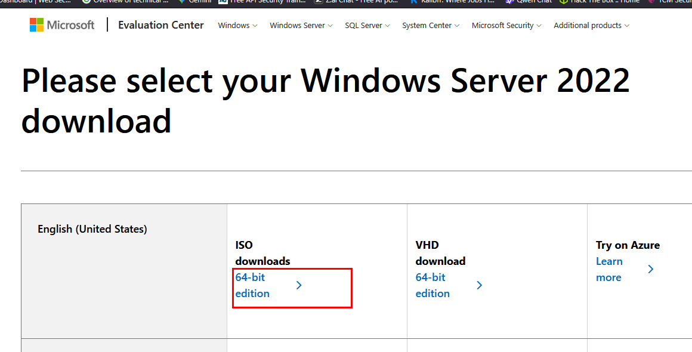

### A2. Create the VM in VirtualBox

1. **New** → Name: `DC01`, Type: Microsoft Windows Server 2022 (64-bit)
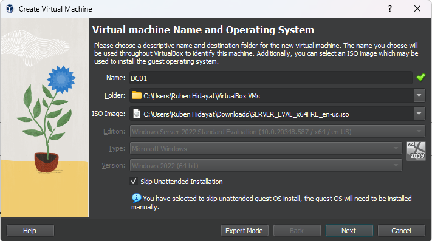

2. Memory: **2048 MB** and Processors: **2 cores**
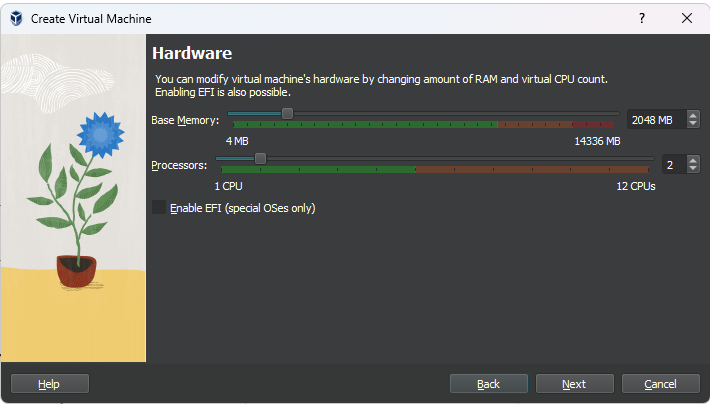

3. Disk: VDI, dynamically allocated, **40 GB**
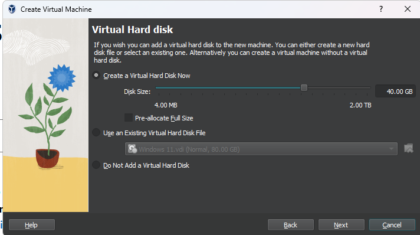

4. Before first boot, in **Settings**: **Network → Adapter 1:** Attached to **Internal Network**, name `intnet`
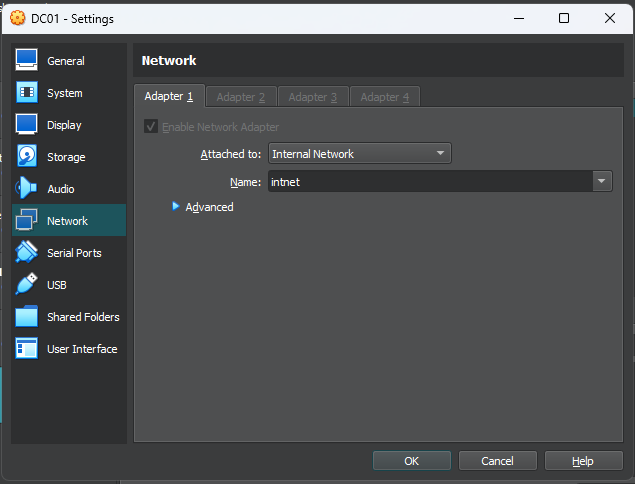

5. **Storage:** mount the Windows Server ISO
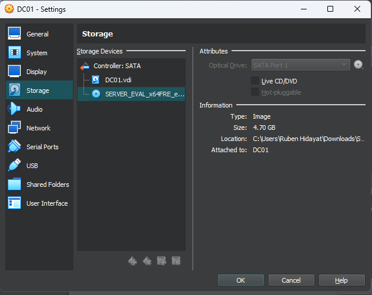

### A3. Install the OS

1. Boot the VM and run through Setup: language → **Next** -> **Install Now**
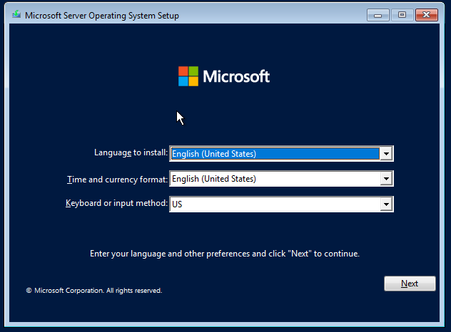

2. Select **Windows Server 2022 Standard** — the image **without** "(Desktop Experience)", i.e. Server Core
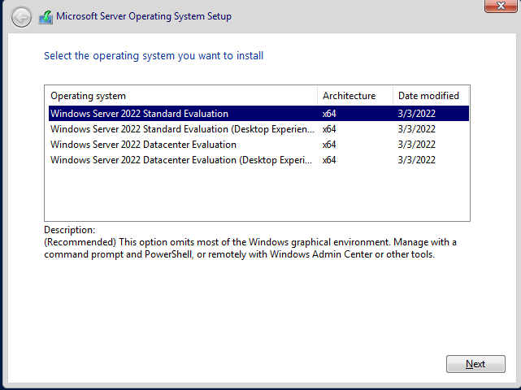

3. Accept license terms → Next

4. **Custom: Install Windows only (advanced)** → select the disk → proceed
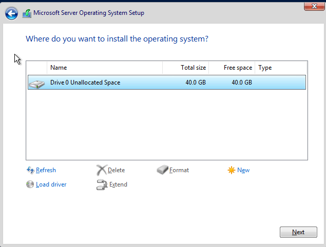

5. Set the local Administrator password at first boot
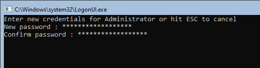

6. Setup completes at a Server Core command prompt

***

## Part B : Client Workstation (CLIENT01)

### B1. Download Windows 11 Enterprise

1. Download the free 90-day evaluation ISO from the [Microsoft Evaluation Center](https://www.microsoft.com/evalcenter/evaluate-windows-11-enterprise)
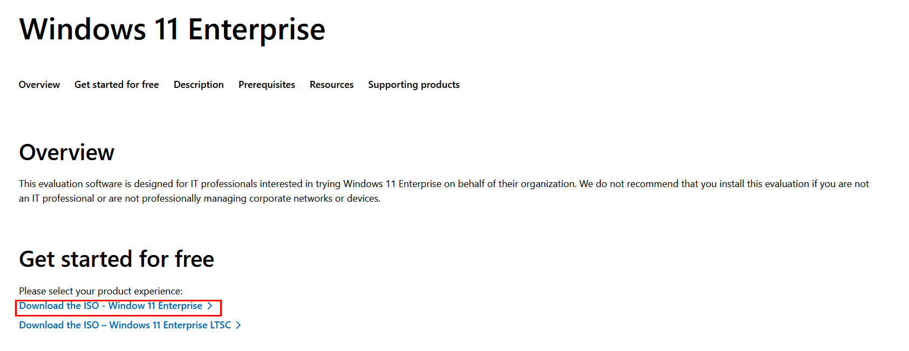

2. select **Windows 11 Enterprise**, ISO format, 64-bit.
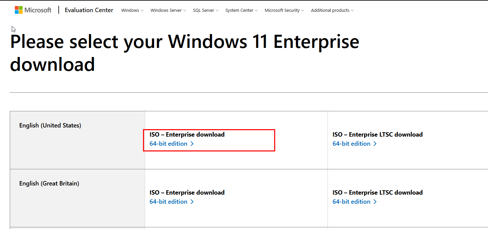

### B2. Create the VM in VirtualBox

1. **New** → Name: `CLIENT01`, Type: Microsoft Windows 11 (64-bit), ISO Name : `26200.6584.250915-1905.25h2_ge_release_svc_refresh_CLIENTENTERPRISEEVAL_OEMRET_x64FRE_en-us.iso`, check skip unattended installation.
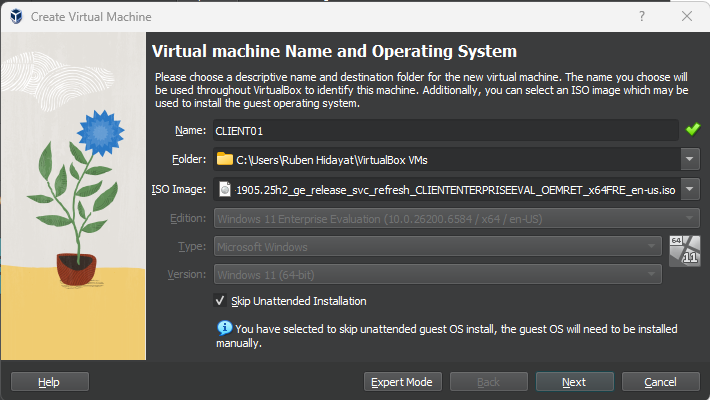

2. Memory: **4096 MB** and Processors: **2 cores**
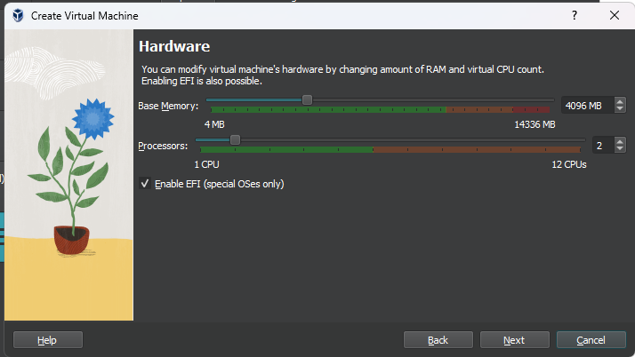

3. Disk: VDI, dynamically allocated, **40 GB**
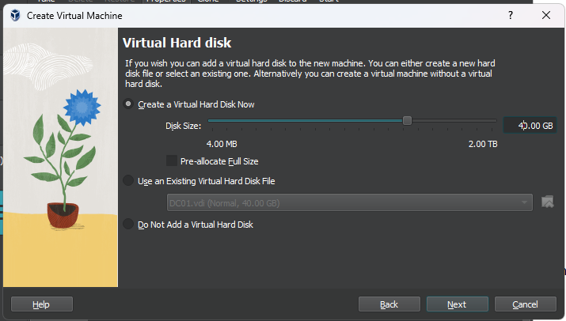

4. Before first boot, in **Settings**: **System → Motherboard:** Enable EFI (required for Windows 11's TPM/Secure Boot check)
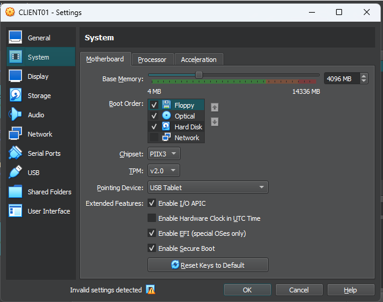

5. **Audio:** disabled
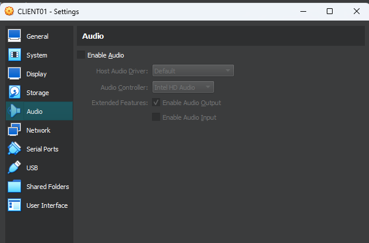

6. **USB:** disabled
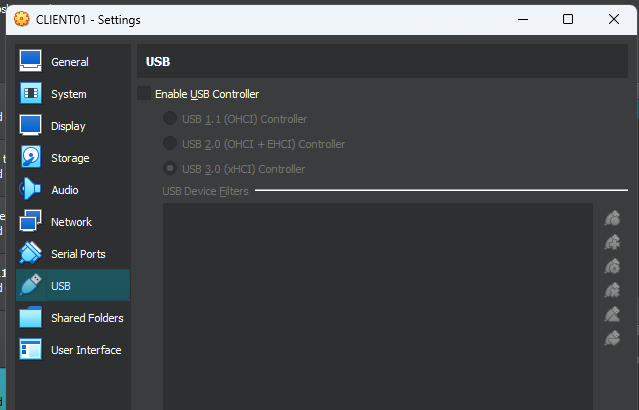

7. **Display:** video memory lowered, 3D acceleration off
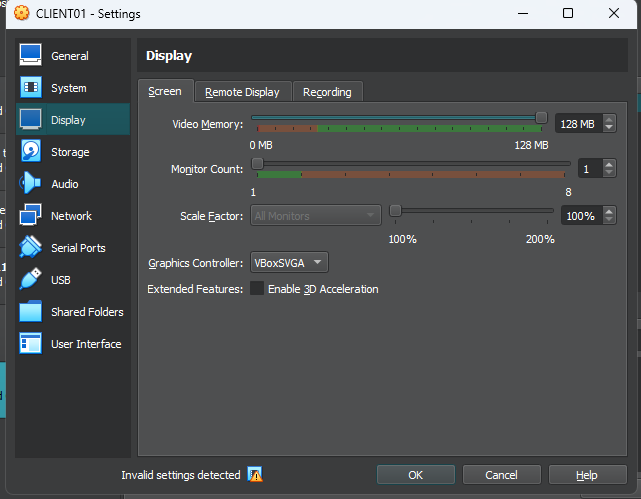

8. **Network → Adapter 1:** Attached to **Internal Network**, name `intnet` — same network as `DC01`
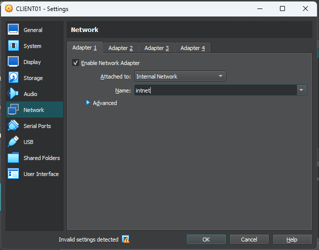

9. **Storage:** mount the Windows 11 ISO
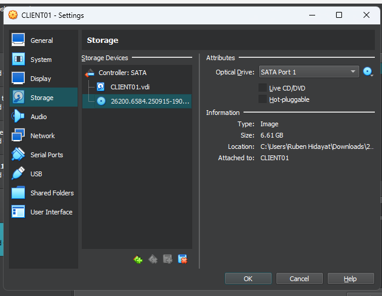

### B3. Install the OS

1. Boot the VM → at the EFI Boot Manager, select the **UEFI CD-ROM** entry

2. Language/time/keyboard → **Install now**
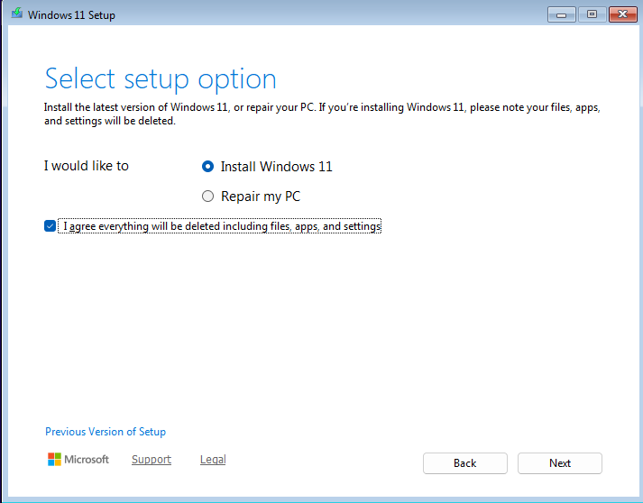

3. **Custom: Install Windows only (advanced)** → select the disk → proceed
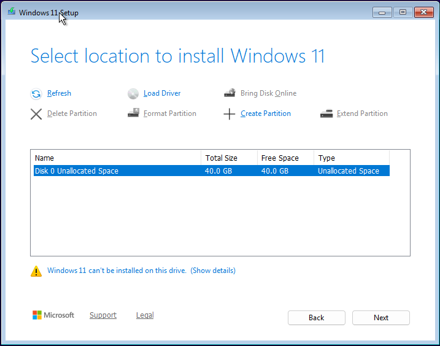

4. Wait till installation complete

### B4. Out-of-Box Setup 

1. Select region andind keyboard layout

2. On the network screen, do not connect to the network yet to avoid creating Microsoft Account

3. Fill 3 Security Questions

4. Choose to create a **local account** rather than signing in with a Microsoft account, so the machine has an independent local administrator ready for the domain join

5. Decline optional telemetry and privacy extras as preferred and wait for the installation over
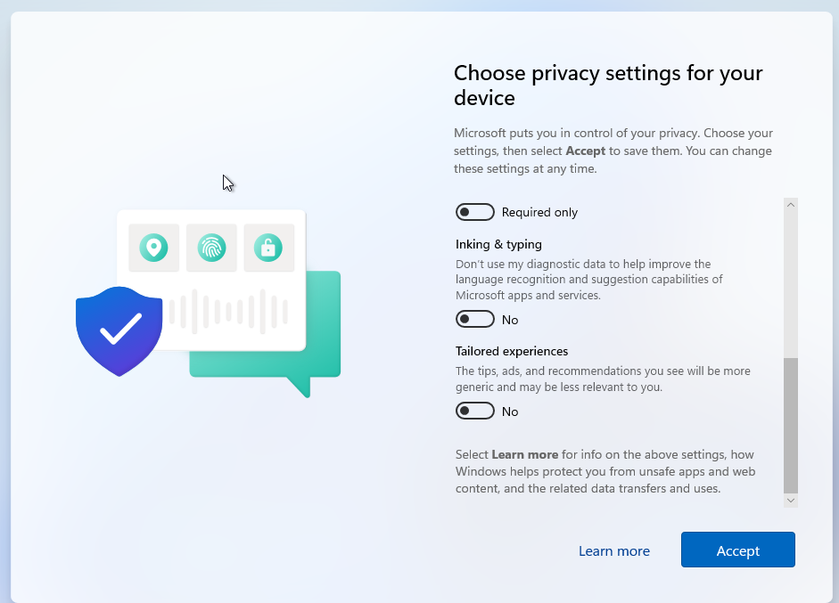

