# 04 - Initial Configuration, Domain Promotion, and Domain Join

## Part A : DC01 - Configuration and Domain Promotion

### A1. Initial Configuration

1. From the `sconfig` menu (launches automatically)
    
    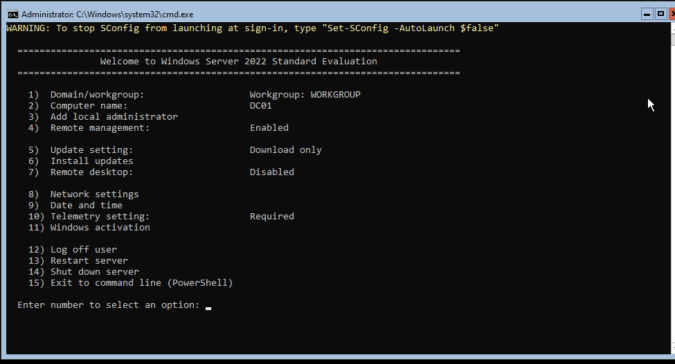

2. From the `sconfig` menu, select **Option 2 — Computer Name:** rename to `DC01`, restart to apply
    
    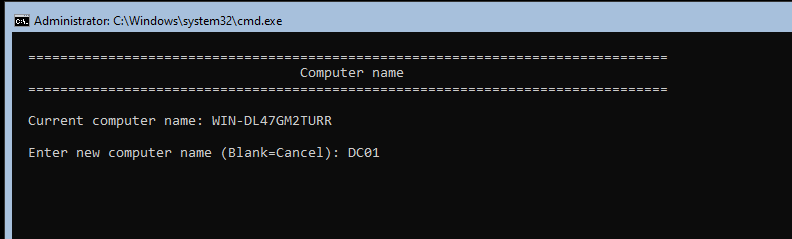

3. **Option 8 — Network Settings:** select the adapter → set a **static IP**:
    - IP address: `192.168.10.1`
    - Subnet mask: `255.255.255.0`
    - Default gateway: leave blank
    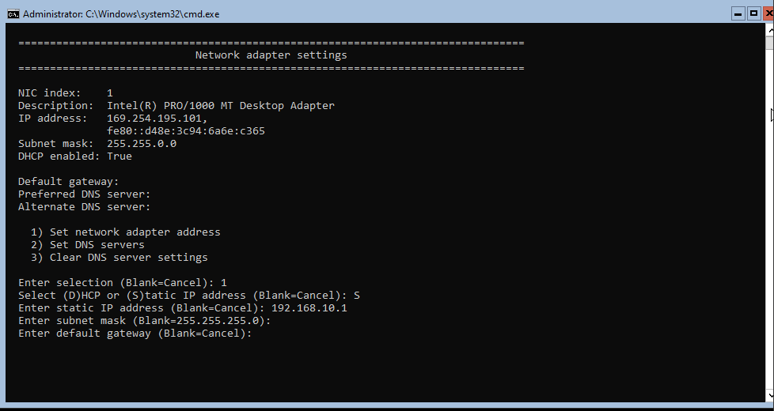
    - Preferred DNS server: `127.0.0.1`
    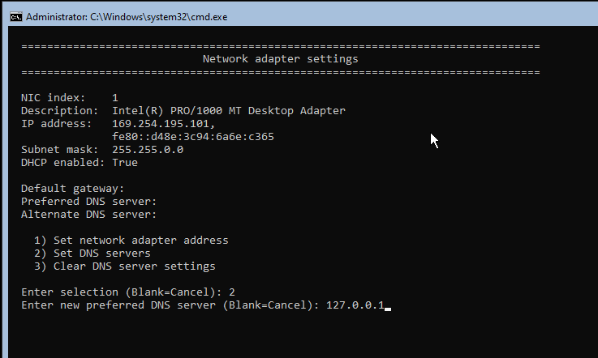


4. From the `sconfig` menu, select **Option 9 — Date and Time:** set the correct timezone

    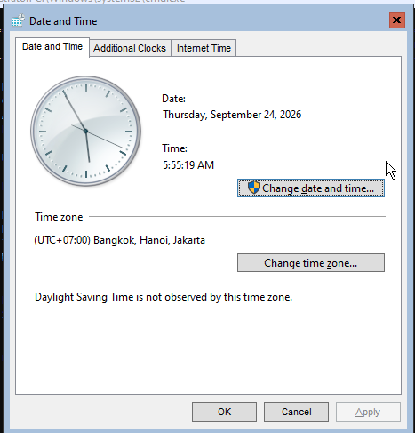

5. Verify with the following command:
    ```powershell
    ipconfig /all
    ```
    
    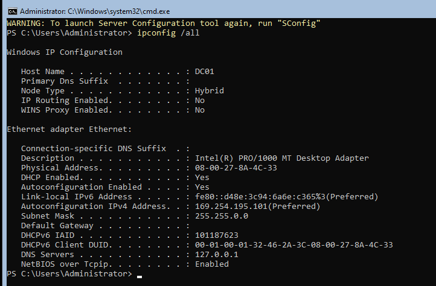
- if the IPv4 is still hasn't changed, use the following command:
    ```
    New-NetIPAddress -InterfaceAlias "Ethernet" -IPAddress 192.168.10.1 -PrefixLength 24
    ```

6. Confirm : `IPv4 Address: 192.168.10.1`, `DNS Servers: 127.0.0.1`, and `DHCP Enabled: No`.
    
    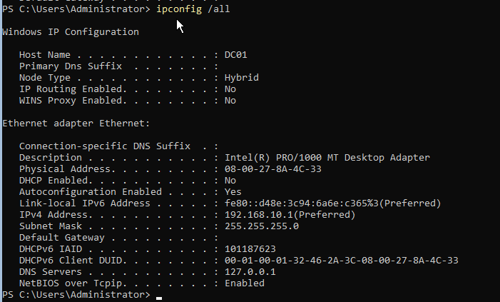


### A2. Install AD DS and Promote to Domain Controller

1. Install AD DS by typing the following commands:
    ```powershell
    Install-WindowsFeature AD-Domain-Services -IncludeManagementTools
    ```
    
    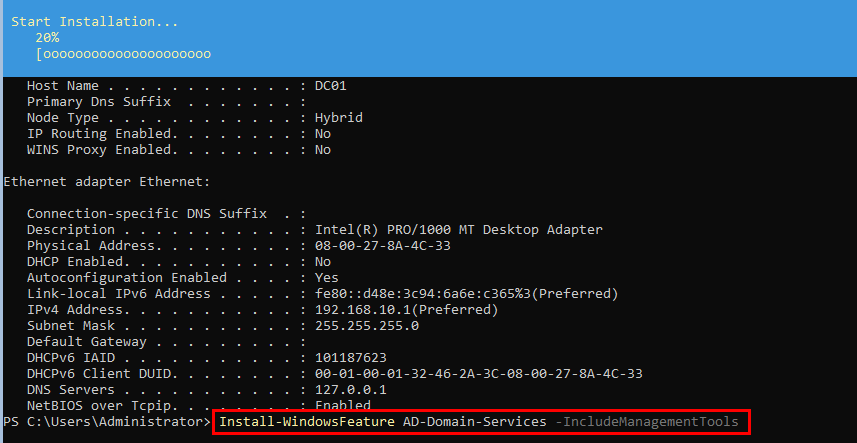

2. Use the following command with the placeholder for password replaced, this is the DIrectory Service Restore Mode (DSRM) password, used only for disaster recovery. The server reboots automatically once promotion completes
    ```powershell
    Install-ADDSForest `
    -DomainName "corp.homelab.local" `
    -DomainNetbiosName "CORP" `
    -InstallDns `
    -SafeModeAdministratorPassword (ConvertTo-SecureString "YourSafeModePass1!" -AsPlainText -Force) `
    -Force
    ```
    
    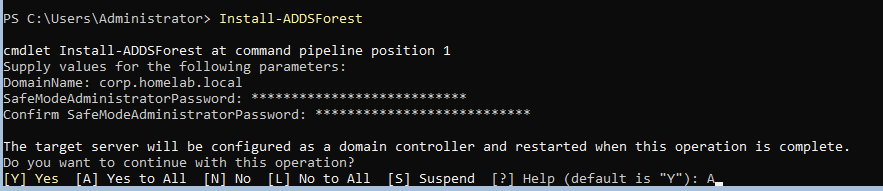


### A3. Verify Domain Controller Status

1. Log back in as `CORP\Adminstrator` and run the following commands
    ```powershell
    Get-ADDomain
    Get-ADForest
    dcdiag /v
    Get-Service NTDS, DNS, Netlogon, KDC | Select Name, Status
    ```

2. **Confirm** : `Get-ADDomain` shows `DNSRoot: corp.homelab.local`
    
    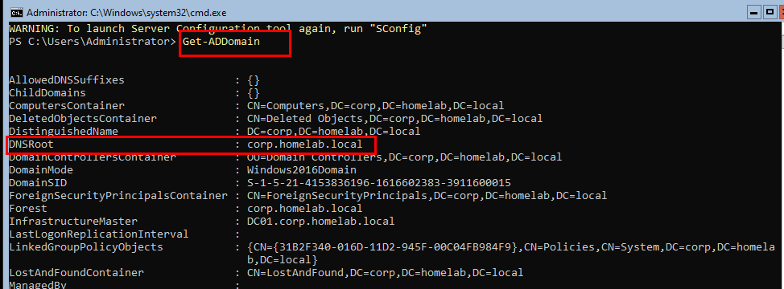

3. DC01 is now a fully functioning domain controller for `corp.homelab.local`.


### A4. Enable Remote Management

1. Enables WinRM so DC01 can be administered remotely from CLIENT01 once RSAT is installed, rather than working directly in the console:
    ```powershell
    Enable-PSRemoting -Force
    Set-NetFirewallRule -DisplayGroup "Windows Remote Management" -Enabled True
    ```
    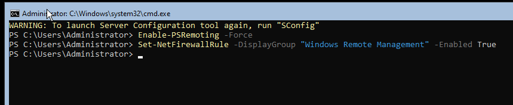

***

## Part B : CLIENT01 - Configuration and Domain Join

### B1. Rename and Configure Networking

1. Change the hostname to `CLIENT01`
    ```powershell
    Rename-Computer -NewName "CLIENT01" -Restart
    ```
    
    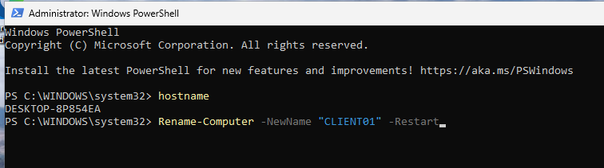

2. Verify
    
    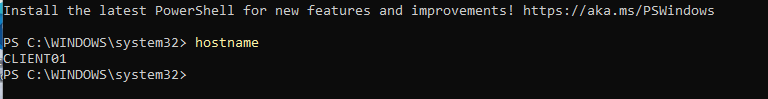

3. After reboot, identify the network adapter and assign a static IP with DNS pointed at `DC01`:
    ```powershell
    Get-NetAdapter
    New-NetIPAddress -InterfaceAlias "Ethernet" -IPAddress 192.168.10.20 -PrefixLength 24
    Set-DnsClientServerAddress -InterfaceAlias "Ethernet" -ServerAddresses 192.168.10.1
    ```
    
    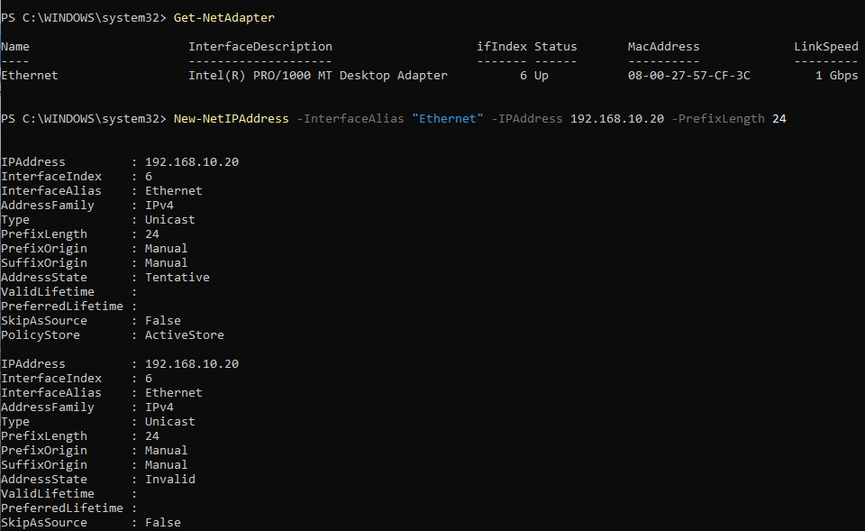

    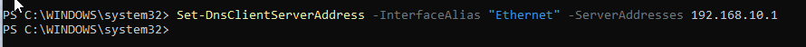

### B2. Verify Domain Reachability

1. With `DC01` powered on, confirm `CLIENT01` can resolve and reach it. Both should succeed before proceeding to the domain join.:
    ```powershell
    nslookup corp.homelab.local
    ping DC01.corp.homelab.local
    ```
    
    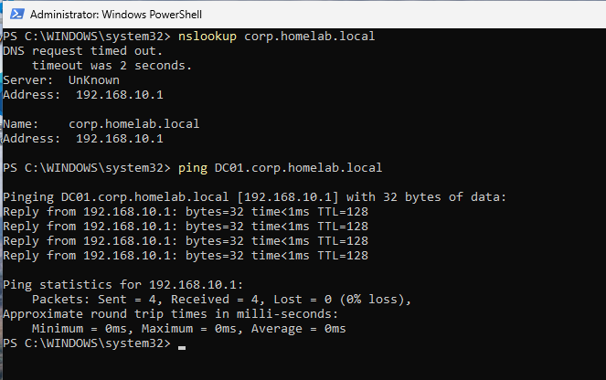

### B3. Join the Domain

1. Join the domain using `CORP\Administration` account and enter its password when prompted
    ```powershell
    Add-Computer -DomainName "corp.homelab.local" -Credential CORP\Administrator -Restart
    ```
    
    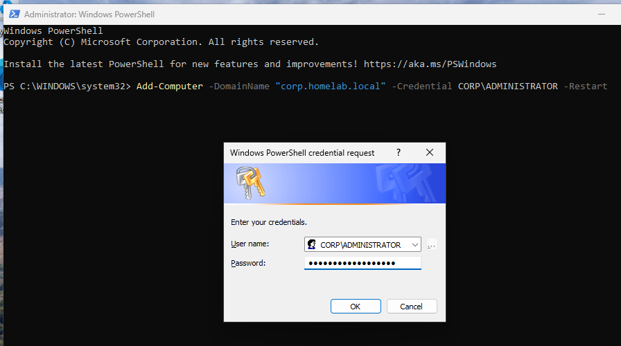

2. Log back in with `CORP\Administrator` (or another domain account) to confirm the join:
    ```powershell
    whoami
    ```
    
    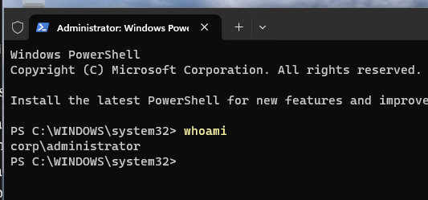


### B4. Install RSAT

1. Before downloading RSAT, shut down the VM -> open `CLIENT01` setting on VirtualBox -> Network -> Adapter 1 -> Attached to: Bridged Adapter -> OK
    
    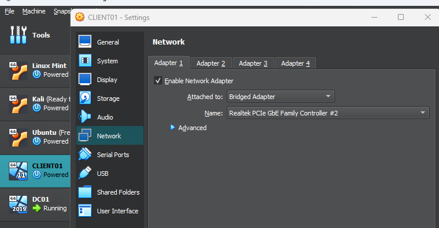

2. Once logged back in type the following command to stop the forced Static IP Address and use DHCP and get the internet connection
    ```powershell
    Set-NetIPInterface -InterfaceAlias "Ethernet" -Dhcp Enabled
    ```

3. Change the DNS too
    ```powershell
    Set-DnsClientServerAddress -InterfaceAlias "Ethernet" -ResetServerAddresses
    ```

4. Verify by pinging google DNS server
    ```powershell
    ping 8.8.8.8
    ```
    
    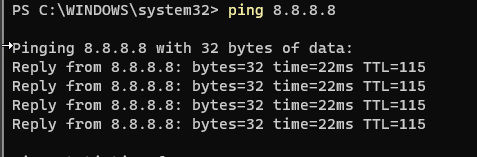

    ```powershell
    nslookup google.com
    ```
    
    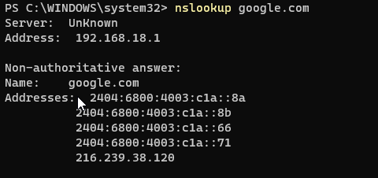

5. Installs the Remote Server Administration Tools, giving `CLIENT01` access to Active Directory Users and Computers (ADUC), Group Policy Management Console (GPMC), and DNS Manager, all pointed at `DC01`:
    ```powershell
    Get-WindowsCapability -Name RSAT* -Online | Add-WindowsCapability -Online
    ```
    
    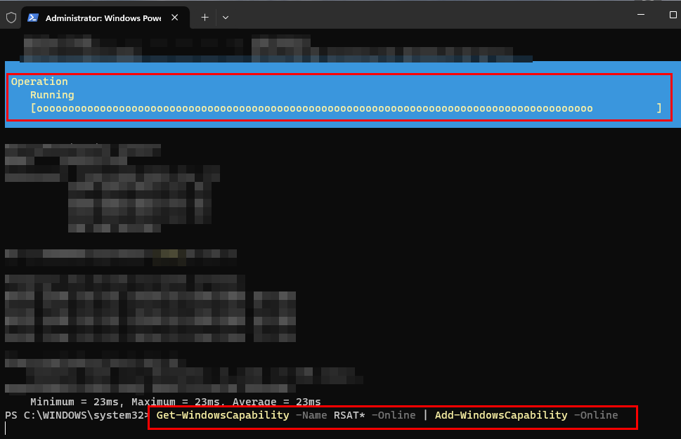

    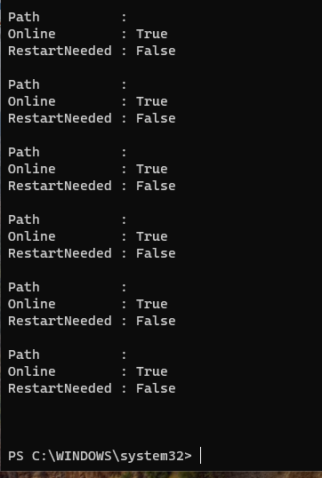

6. Once it finished, to verify, there'll be ADUC, ADSS, ADDT in search
    
    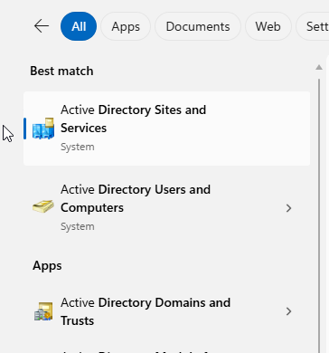