# 05 - Organization Units, Users, Groups and Shared Folder Permissions

## Overview

This phase builds out the actual directory content: the OU structure, user accounts, security groups, and a shared folder secured with both NTFS and share-level permissions. All steps are run from **CLIENT01** using RSAT, connected to `corp.homelab.local`.

Repetitive, multi-item tasks (creating several OUs, several groups, many users at once) use **PowerShell**, since scripting them is faster, repeatable, and demonstrates automation skills. One-off, single-item tasks (creating one user by hand, sharing one folder) use the **GUI**, since that's the realistic helpdesk workflow for isolated requests.

***

## Part A : Organizational Unit Structure (PowerShell)

1. Open **Windows Power** on `CLIENT01` (as a domain admin `CORP\Administrator`)

2. Creating the full OU tree by hand in ADUC would mean dozens of repetitive clicks, so this is scripted, the structure would be like this
    ```txt
    corp.homelab.local
    ├── CORP-Departments
    │   ├── IT / Sales / HR / Finance
    │   │   ├── Users
    │   │   └── Workstations
    ├── CORP-Groups
    └── CORP-ServiceAccounts
    ```

2. The script : 
    ```powershell
    New-ADOrganizationalUnit -Name "CORP-Departments" -Path "DC=corp,DC=homelab,DC=local"

    $depts = "IT","Sales","HR","Finance"
    foreach ($d in $depts) {
        New-ADOrganizationalUnit -Name $d -Path "OU=CORP-Departments,DC=corp,DC=homelab,DC=local"
        New-ADOrganizationalUnit -Name "Users"        -Path "OU=$d,OU=CORP-Departments,DC=corp,DC=homelab,DC=local"
        New-ADOrganizationalUnit -Name "Workstations" -Path "OU=$d,OU=CORP-Departments,DC=corp,DC=homelab,DC=local"
    }

    New-ADOrganizationalUnit -Name "CORP-Groups" -Path "DC=corp,DC=homelab,DC=local"
    New-ADOrganizationalUnit -Name "CORP-ServiceAccounts" -Path "DC=corp,DC=homelab,DC=local"
    ```
    - Script Explanation
        - `New-ADOrganizationalUnit` : New OU
        - `-Name` : The OU's display name
        - `-Path` : Where to create it, expressed as **Distinguished Name (DN)**. 
        - `DC=corp,DC=homelab,DC=local` : The root of the domain `corp.homelab.local` (`DC` : Domain Component, one per label in the domain name)
        - `$depts = "IT","Sales",...` : Creates an array stored in the variable `$depts`
        - `foreach ($d in $depts) { }` : loops through the array one item at a time, temporarily assigning each value to `$d` inside the braces

2. Verify using GUI:

    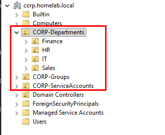

3. Verify using PowerShell
    ```powershell
    Get-ADOrganizationalUnit -Filter * | Select Name, DistinguishedName
    ```
    
    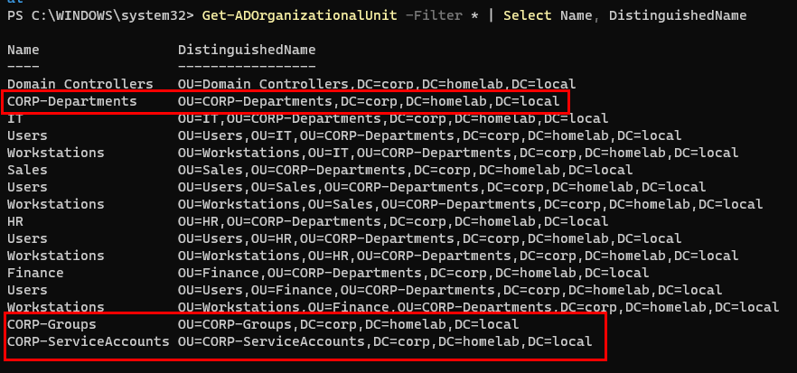

***

## Part B : User Accounts

1. Open **Active Directory Users and Computers**

2. Navigate to `corp.homelab.local → CORP-Departments → IT → Users`

3. Right-click the **Users** OU → **New → User**
    
    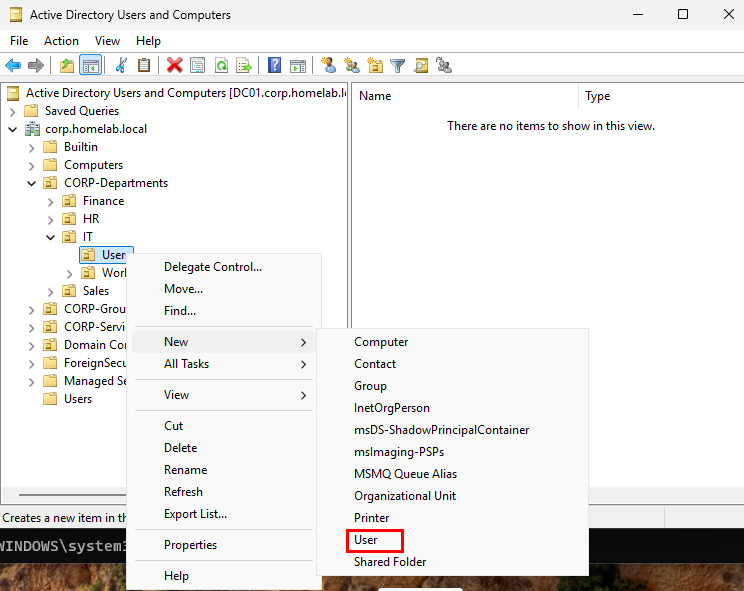

4. Fill in First name, Last name, User logon name (e.g. `jsmith`) -> Next
    
    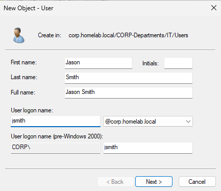

5. Next → set a temporary password → check **User must change password at next logon**
    
    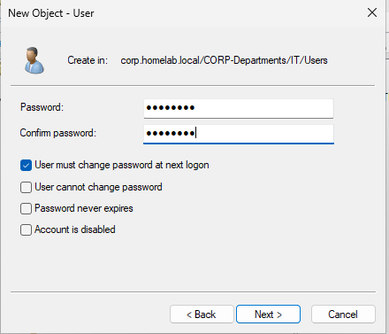

6. Next → Finish
    
    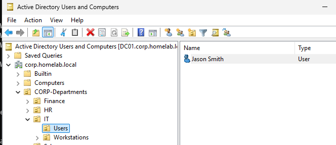


### B2. Bulk-Create Users from CSV (PowerShell)

1. For anything beyond a handful of accounts, scripting from a CSV is the realistic approach

2. Create a file named `users.csv` with this structure
    ```csv
    FirstName,LastName,SamAccountName,Department,OU
    John,Doe,jdoe,IT,"OU=Users,OU=IT,OU=CORP-Departments,DC=corp,DC=homelab,DC=local"
    Ruben,Hidayat,rhidayat,IT,"OU=Users,OU=IT,OU=Corp-Departments,DC=corp,DC=local"
    Jane,Roe,jroe,Sales,"OU=Users,OU=Sales,OU=CORP-Departments,DC=corp,DC=homelab,DC=local"
    Amy,Lee,alee,HR,"OU=Users,OU=HR,OU=CORP-Departments,DC=corp,DC=homelab,DC=local"
    ```

3. Then run the following script:
    ```powershell
    $users = Import-Csv -Path "C:\Users\administrator\Desktop\users.csv"

    foreach ($u in $users) {
        New-ADUser `
            -Name "$($u.FirstName) $($u.LastName)" `
            -GivenName $u.FirstName `
            -Surname $u.LastName `
            -SamAccountName $u.SamAccountName `
            -UserPrincipalName "$($u.SamAccountName)@corp.homelab.local" `
            -Path $u.OU `
            -Department $u.Department `
            -AccountPassword (ConvertTo-SecureString "TempPass123!" -AsPlainText -Force) `
            -ChangePasswordAtLogon $true `
            -Enabled $true
    }
    ```
    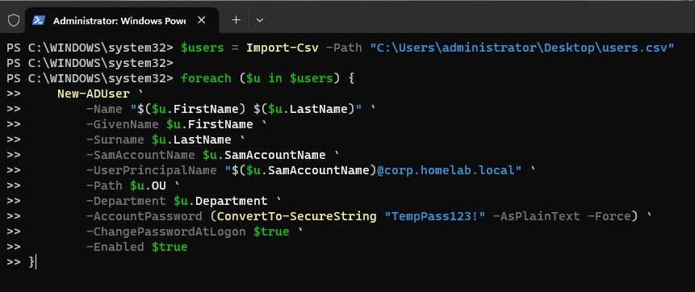
    - Script Explanation:
        - `Import-Csv` reads a CSV and converts each row into an object, using the header row as property names — that's why `$u.FirstName` works: `FirstName` is a column header
        - `New-ADUser` : Create new AD user
        - The backtick \`  : At the end of a line is PowerShell's **line continuation character**, tells it "This command is not finished, keep reading the next line". Purely for readability purpose. This command works the same as one liner
        - `$u.FirstName` : Dot notation, accessing the `FirstName` property of the object `$u` (each row from the CSV becomes an object with one property per column)
        - `"$($u.FirstName) $($u.LastName)"` — the extra `$( )` wrapper is needed because you're accessing a property inside a string; plain `$u.FirstName` inside quotes wouldn't expand correctly without it
        - `-AccountPassword (ConvertTo-SecureString "TempPass123!" -AsPlainText -Force)` — AD refuses plain-text passwords; `ConvertTo-SecureString` wraps it into a `SecureString` object first. `-Force` suppresses the "this is insecure" confirmation prompt.
        - `-Enabled $true` — `$true`/`$false` are PowerShell's boolean 

4. Verify
    ```powershell
    Get-ADUser -Filter * -SearchBase "OU=CORP-Departments,DC=corp,DC=homelab,DC=local" | Select Name, SamAccountName
    ```
    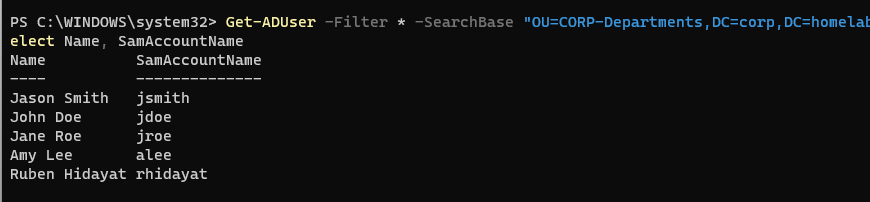

***

## Part C : Security Groups

### C1. Create One Group Manually (GUI)

1. In ADUC, navigate to `CORP-GROUPS`

2. Right-click -> **New** -> **Group**
    
    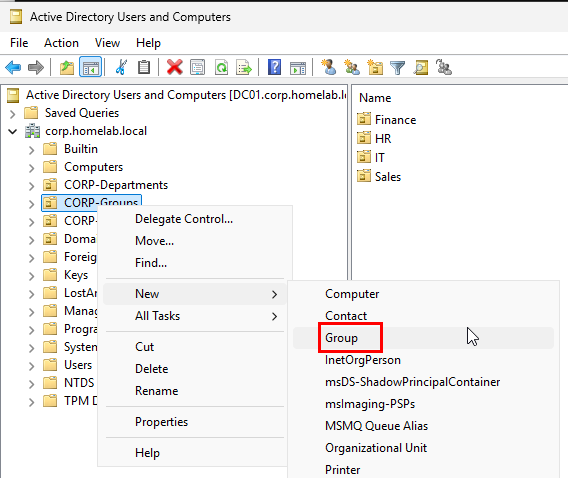

3. Group name : e.g., `GG-IT-Team` (GG stands for Global Group)

4. Group scope : **Global**, Group type : **Security**
    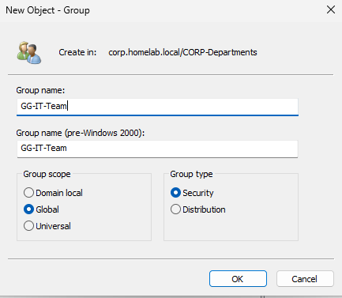

5. Finish
    
    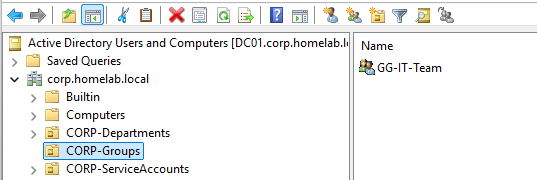


### C2. Bulk-Create Role-Based Groups (PowerShell)

1. One security group per department, for role-based access control. To do that, run the following script:
    ```powershell
    $depts = "IT","Sales","HR","Finance"
    foreach ($d in $depts) {
        New-ADGroup `
            -Name "GG-$d-Users" `
            -GroupScope Global `
            -GroupCategory Security `
            -Path "OU=CORP-Groups,DC=corp,DC=homelab,DC=local"
    }
    ```
    - Command Explanation
        - `-GroupScope Global` : One of three AD scopes (Domain Local, Global, Universal). Global group are typically used to organize users by role and are usable domain wide.
        - `-GroupCategory Security` : The other option is `Distribution` (for email lists, no access-control function). Security groups can actually be granted permissions

2. Verify

    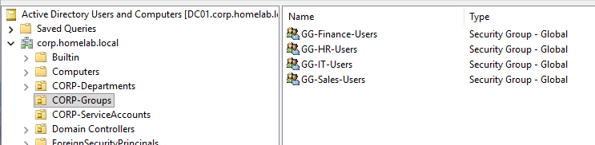
    
3. Add Users to their department's group:
    ```powershell
    Add-ADGroupMember -Identity "GG-IT-Users" -Members "jdoe","jsmith"
    Add-ADGroupMember -Identity "GG-IT-Users" -Members 
    Add-ADGroupMember -Identity "GG-Sales-Users" -Members "jroe"
    Add-ADGroupMember -Identity "GG-HR-Users" -Members "alee"
    ```
    - Command Explanation
        - `-Identity` : Which group to modify (accepts name, SamAccountName, or DN)
        - `-Members` : Accepts a single account or comma-separated list to add multiple at once

4. Verify

    ```powershell
    Get-ADGroupMember -Identity "GG-IT-Users"
    ```
    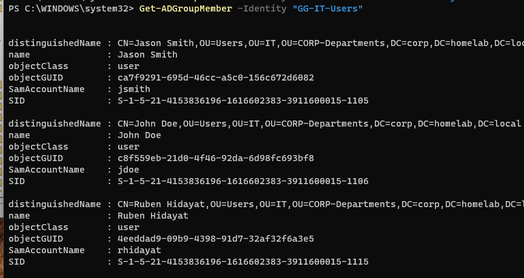

***

## Part D: Shared Folder with NTFS + Share Permissions (GUI)

A single shared resource is naturally a GUI task, this mirrors exactly how a tech would set one up on request. 

### D1. Create and Share the Folder

1. On `CLIENT01` as `CORP\Administrator` account, open File Explorer

2. In the address bar, type `\\DC01\c$` and press Enter. This is `DC01`'s C:drive, exposed over the network via the built-in administrative share (requires domain admin rights, which `CORP\Administrator` has)

    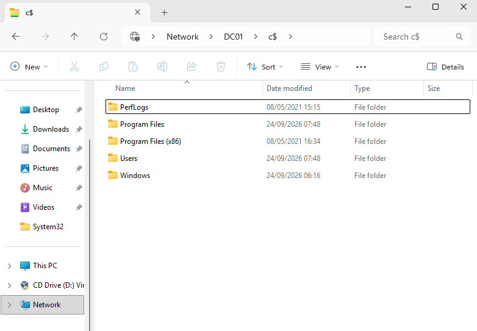

3. Create a new folder here, e.g., `C:\Shares\IT-Department` (Create `Shares` first if it does not exist yet, then `IT-Department` inside it)

    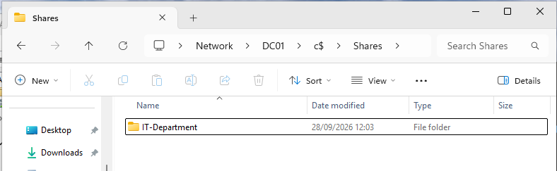

4. Open **Computer Management** (`compmgmt.msc`)

    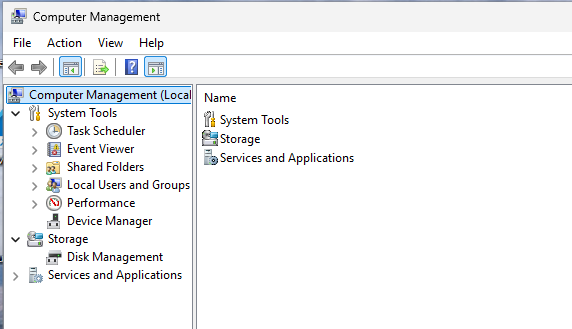

5. Right-click **Computer Management (Local) -> Connect to another Computer** -> select **Another Computer**, type `DC01`, Ok

    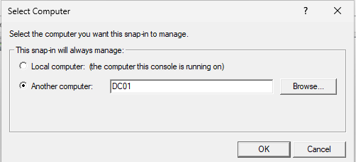

6. Expand **System Tools** -> **Shared Folders -> Shares**

7. Right-click **Shares -> New Share**

    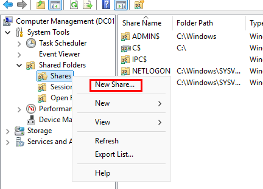

8. Set the folder path to `C:\Shares\IT-Department` 

    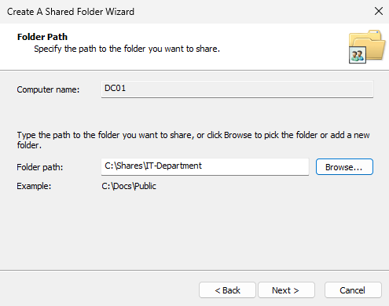

9. Set the share name to `IT-Department`

    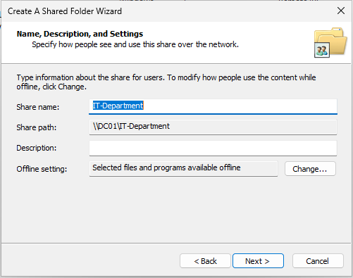

10. Choose **Customize Permissions -> Share Permissions ->** Remove **Everyone** -> Add `GG-IT-Users` ->Allow **Change and Read**

    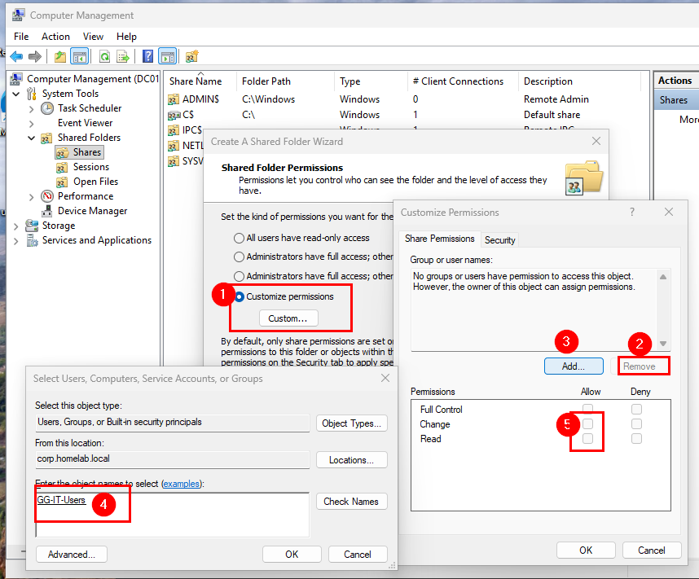

11. Finish

### D2. Set NTFS Permission

1. Go to `\\DC01\c$\Shares\IT-Department` ->**Properties -> Security Tab -> Advanced**

    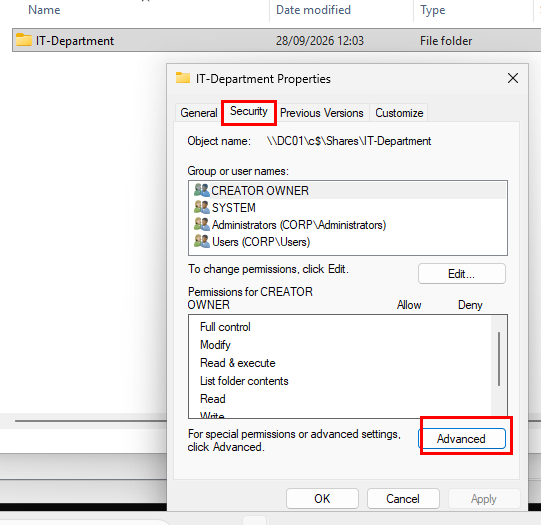

2. Click **Disable Inheritance** -> Choose **Convert inherited permissions into explicit permissions on this object** (do not choose "Remove All", which also removes SYSTEM and Administrators) -> **Apply**

    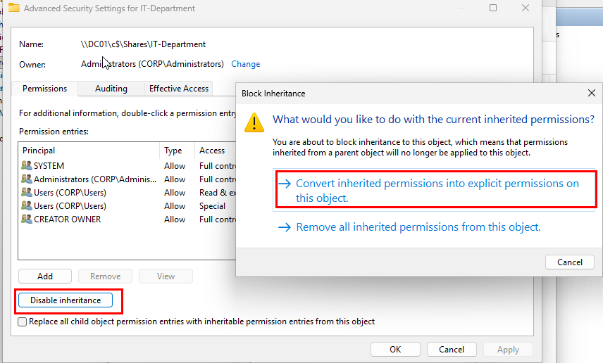

3. Back in Security Tab -> **Edit** -> Select `Users` -> **Remove** (It can only be removed after inheritance is disabled)

    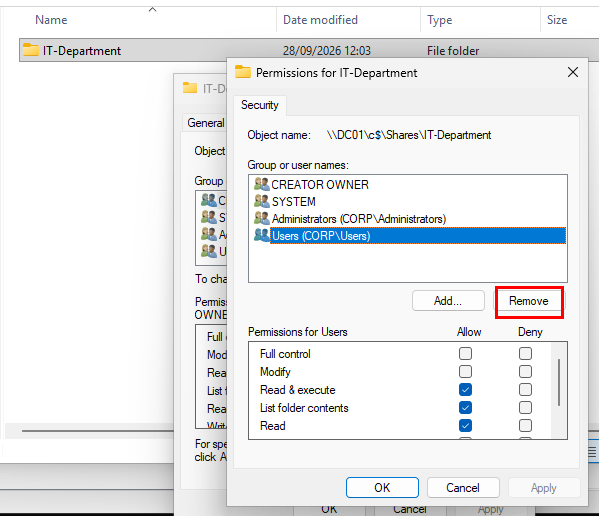

4. Keep `SYSTEM` and `Administrators`

5. Add `GG-IT-Users` 

    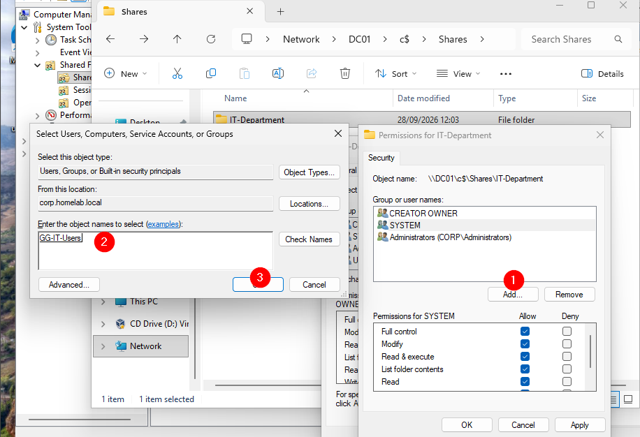

6. Grant Modify (Includes read & execute, List Folder Contents, Read, Write)

    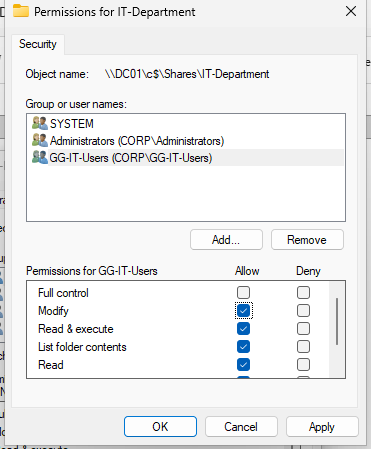

7. Apply -> OK

> **Why Both Shared Folder over the domain and NTFS** : Share permission control access over the network. NTFS permission control access on the filesystem itself. The **more restrictive of the two always wins**, so both need to be set correctly for intended access level


### D3. Verify from CLIENT01 as a Regular User

1. Log in as a member of `GG-IT-Users` (e.g., `rhidayat`) on CLIENT01

    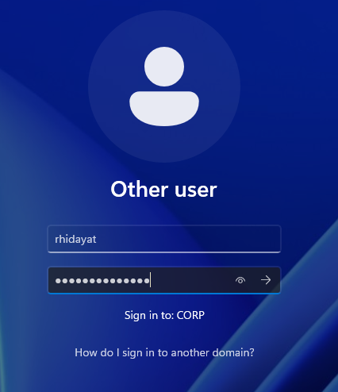

2. Then use the following command:
    ```powershell
    net use Z: \\DC01\IT-Department
    ```
    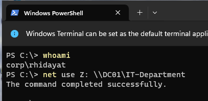

3. Confirm the drive maps successfully and the user can read/write inside it. 

    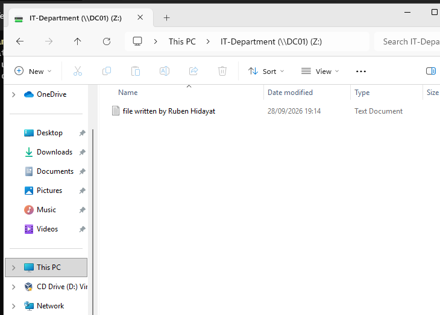

4. Log in to a user **not** in the group (e.g., `alee` from HR) and confirm access is denied

    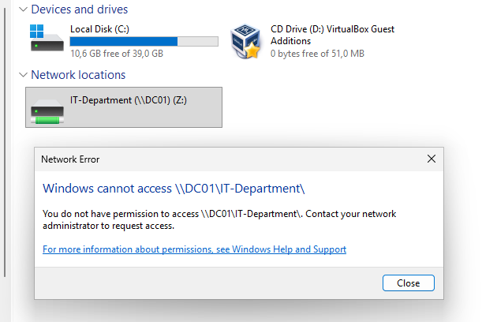