# 06 - Group Policy and Delegated Access

## Overview

- Configuring domain-wide security policy and a login-time drive mapping using Group Policy. Password and lockout policy. Password and lockout policy are edited on the built-in **Default Domain Policy** through the GUI, since it's a one-time settings change on a single object. The drive mapping uses a separate, purpose-built GPO linked to the IT OU, so it only affects the intended group of machines/users
- All steps are run from `CLIENT01` using **Group Policy Management Console (GPMC)**, part of RSAT

***

## Part A : Password & Account Lockout Policy

Domain-wide password and lockout settings can only be set at the domain level, on the **Default Domain Policy**. 

### A1. Open Group Management

1. On `CLIENT01` using `CORP/Administrator` account, open **Group Policy Management** (`gpmc.msc` or via Start menu) 

    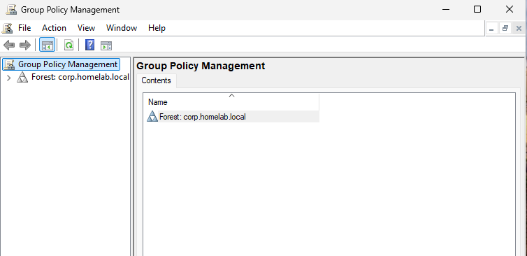

2. Expand Forest: **corp.homelab.local** -> **Domains -> corp.homelab.local**

    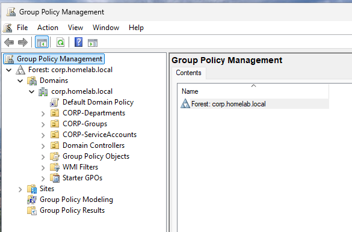

3. Right-click **Default Domain Policy -> Edit**

    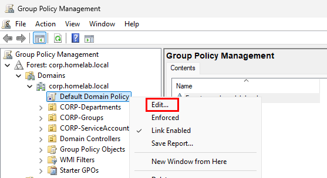


### A2. Configure Password Policy

In the Group Policy Management Editor:

1. Navigate to **Computer Configuration -> Policies -> Windows Settings -> Security Settings -> Account Policies -> Password Policy**

    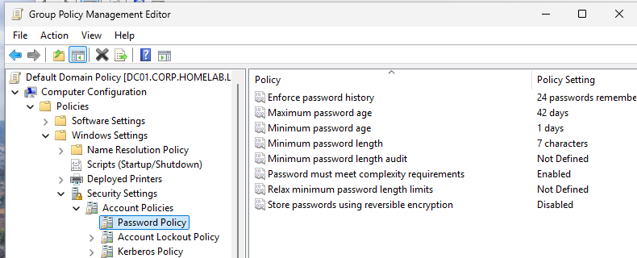

2. Set the following (adjust to taste, these are reasonable lab defaults):
    - **Enforce Password History** : 5 password remembered
	- **Maximum password age** : 90 days
	- **Minimum password age** : 1 day
	- **Minimum password length** : 8 characters
	- **Password must meet complexity requirements** : Enabled

        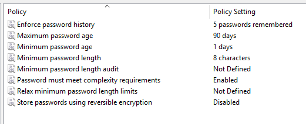


### A3. Configure Account Lockout Policy

1. Same location, one level down : **Account Policies -> Account Lockout Policy**

    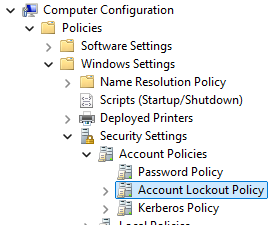

2. **Account lockout threshold** : 7 Invalid logon attempts

3. Setting this automatically populates sensible defaults for the next two; accept or adjust:
    - **Account lockout duration** : 15 minutes
    - **Reset account lockout counter after** : 15 minutes

        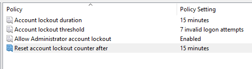

4. Close the editor

### A4. Apply and Verify

Policy changes on the DC take effect domain-wide on the next policy refresh cycle (default every 90 minutes), or immediately if forced

1. **On `CLIENT01`** : 
    ```powershell
    gpupdate /force
    ```

    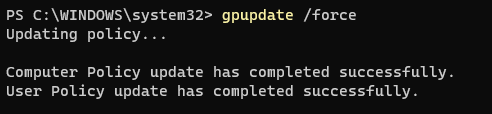

2. Verify the settings actually landed, look for `Default Domain Policy` listed under **Applied Group Policy Objects**

    ```powershell
    gpresult /r
    ```
    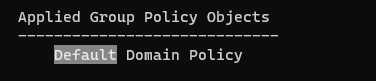

3. For a definitive check of the values themselves, from `CLIENT01`:

    ```powershell
    Get-ADDefaultDomainPasswordPolicy
    ```
    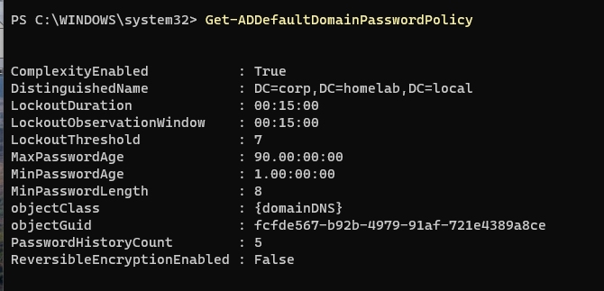

>This returns the live values (`MinPasswordLength`, `LockoutThreshold`, etc) as recorded in AD. the most reliable way to confirm the policy actually applied, independent of any specific machine's refresh timing

***

## Part B : Drive Mapping via Group Policy Preference

- Drive mapping in Active Directory (AD) is the process of automatically assigning a local drive letter (like H: or S:) to a shared folder on a network server when a user logs in.
- Unlike the domain-wide password policy, a drive mapping should only to a specific group of users. 
- In this case, the IT department, using the `IT-Department` share and `GG-IT-Users` group. 
- This calls for its own GPO, linked only to the relevant OU, rather than being bolted onto the Default Domain Policy

### B1. Create a New GPO

1. In Group Policy Management, right-click the **IT** OU under `CORP-Department`

2. Select **Crete a GPO in this domain, and Link it here**

    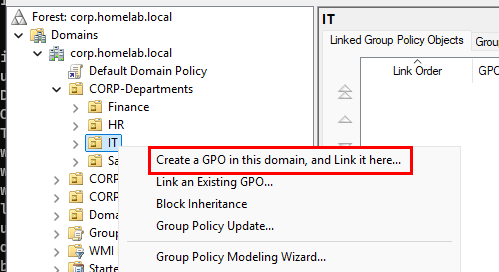

3. Name it `GPO-IT-DriveMapping`

    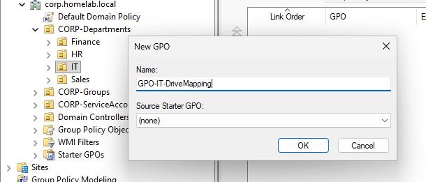


### B2. Configure the Drive Map

1. Right-click `GPO-IT-DriveMapping` -> **Edit**

    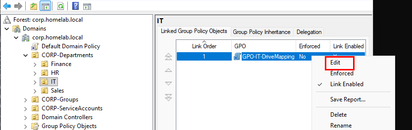

2. Navigate to **User Configuration -> Preferences -> Windows Settings -> Drive Maps**

    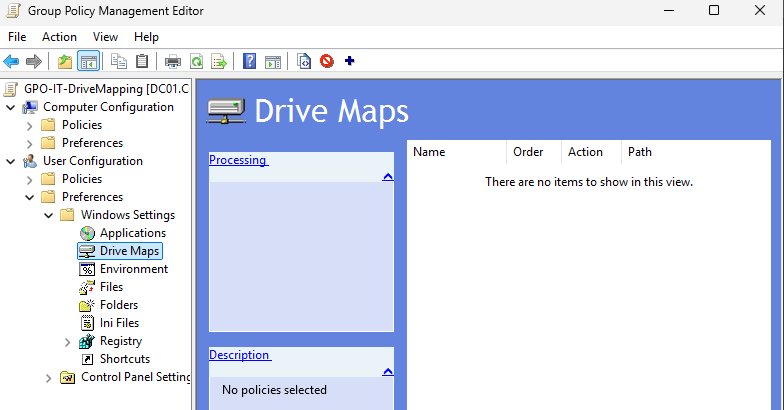

3. Right-click **Drive Maps -> New -> Mapped Drive**

    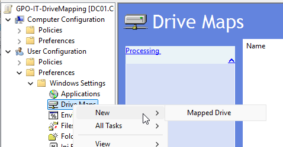

4. Configure:
    - **Action:** Create
	- **Location** : `\\DC01\IT-Department`
	- **Drive Letter:** Choose an unused letter, e.g., `I:`
	- **Reconnect** : Checked, so it persists across logons
    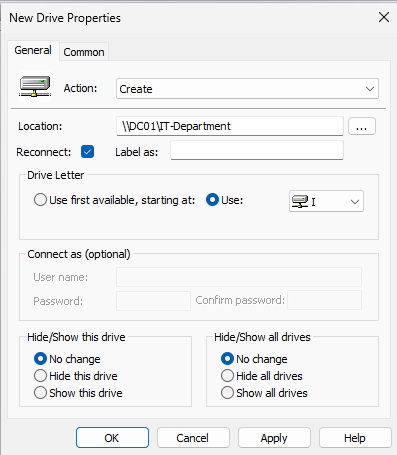

5. On the **Common** tab, check **Item-level targeting -> Targeting Editor -> New Item -> Security Group** -> Select `GG-IT-Users`

    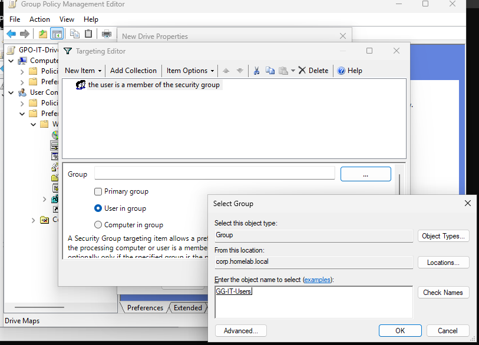

6. Ok -> Apply

>Item-level targeting ensures the drive only maps for members of that group, even though the GPO is linked at the OU level. Useful if the OU ever contains accounts outside that group.

### B3. Apply and Verify

1. On `CLIENT01`, logged in as a member of `GG-IT-Users` (e.g., `rhidayat`)

    ```powershell
    gpupdate /force
    ```
    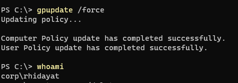

2. Log off and back on (drive maps under User Configuration apply at logon, not on live `gpoupdate`), then confirm by checking file explorer:

    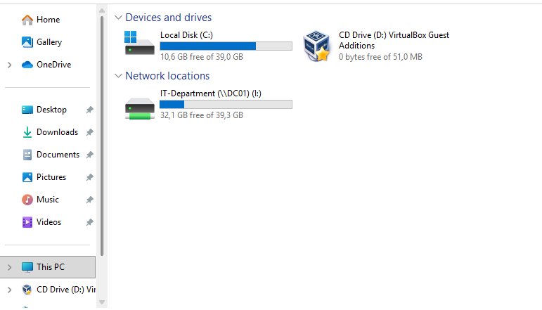

3. This does not appear for user from different group e.g., `alee` from HR

    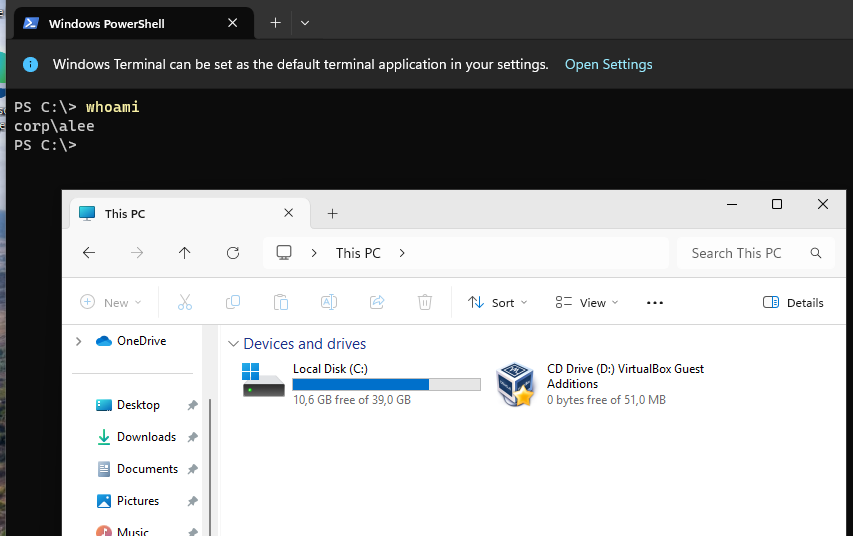

> use `net use Z: /delete` if the old drive is still exists

***

## Part C : Delegating Helpdesk Permission to IT support Staff

- Up to this point, all administration ahs been done as `CORP\Administrator`, a full Domain Admin account.
- In real environment, helpdesk/IT support staff should not have full Domain Admin rights, they need just enough access to resolve day-to-day tickets (password resets, account unlocks, group membership changes) without the ability to touch domain wide settings, GPOs, or other department's infrastructure.
- This is done with the **Delegation of Control Wizard** which grants scoped permissions on a specific OU rather than domain-wide rights.

### C1. Create Control via the Wizard

1. In the **Active Directory Users and Computers**, right-click the **CORP-Department** OU -> Delegate Control

    

2. **Next** past the welcome screen

3. **Users or Group** page -> **add** -> Select `GG-IT-Users` -> Next

    

4. **Tasks to Delegate** -> Choose **Delegate the following common tasks** -> Check:
	- Create, delete, and manage user acounts
	- Reset user passwords and force password change at next logon
    
    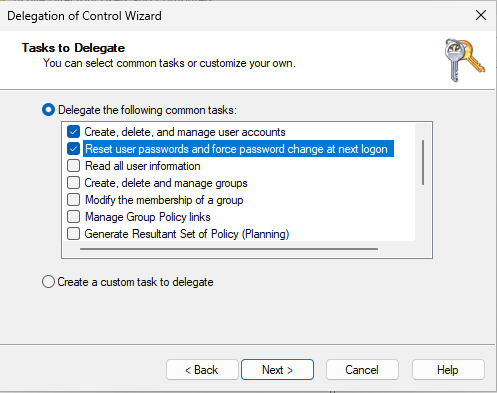

5. Next -> Finish

>"Create, delete, and manage user accounts" covers onboarding (new accounts), offboarding (disabling/deleting), and general account edits. Delegating on `CORP-Departments` applies recursively to every OU underneath. IT, Sales, HR, and Finance. Matching a helpdesk role that supports the whole company.

### C2. Delegate Group Membership Management on CORP-Groups

Fixing "user isn't in the right group" tickets requires permission on the **groups** not the users, so this is delegated separately, on the OU that actually holds the groups

1. Right-click the **Corp-Groups** OU -> **Delegate Control -> Next** 

2. **Add -> `GG-IT-Users` -> OK -> Next**

3. **Tasks to Delegate** -> Check
	- **Modify the membership of a group**
    
    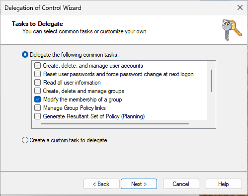

    - Next -> Finsih

### C3. Delegate Account Unlock Rights (Custom Task)

Unlocking a locked a locked-out account is controlled by a separate attribute, `lockoutTime`, which the "Reset user password" common task does not cover despite how it's commonly described

1. Right-click **CORP-Departments** → **Delegate Control** → Next

    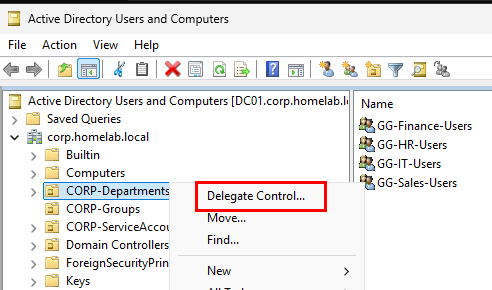

2. **Add** → `GG-IT-Users` → OK → Next

    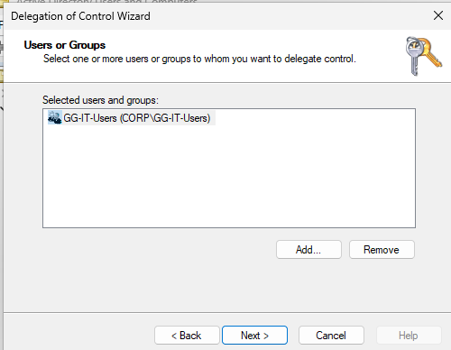

3. Select **Create a custom task to delegate** → Next

    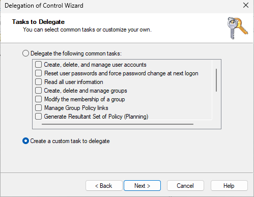

4. Choose **Only the following objects in the folder** → check **User objects** → Next

    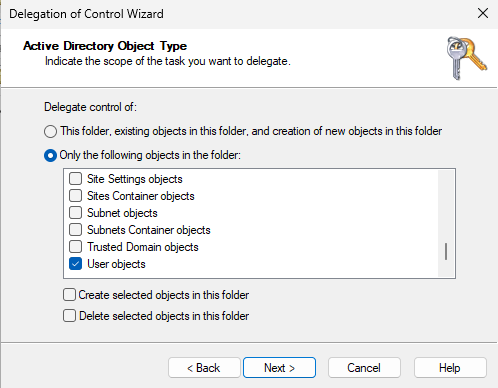

5. Under **Permissions**, check **Property-specific** → scroll and check **Write lockoutTime** → Next → Finish

    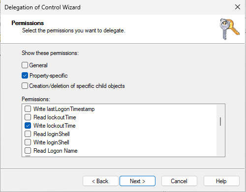

### C4. Verify the Delegation

1. Log in to `CLIENT01` as a member of `GG-IT-Users` e.g., `rhidayat` and confirm the scoped rights work, and nothing beyond them does.

2. This command should succeed, because it's in scope of the delegation

    ```powershell
    New-ADUser -Name "Test Account" -SamAccountName testacct -Path "OU=Users,OU=IT,OU=CORP-Departments,DC=corp,DC=homelab,DC=local" -Enabled $false
    Set-ADAccountPassword -Identity jroe -Reset -NewPassword (ConvertTo-SecureString "TempPass123!" -AsPlainText -Force) 
    Unlock-ADAccount -Identity jroe
    Add-ADGroupMember -Identity "GG-Sales-Users" -Members jroe
    Remove-ADUser -Identity testacct -Confirm:$false
    ```

    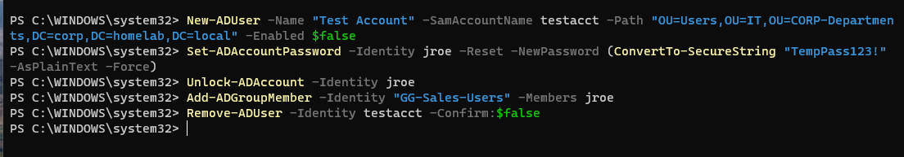


4. This command should fail, because it's outside the delegation, proving the least privilege actually holds

    ```powershell
    New-ADOrganizationalUnit -Name "TestOU" -Path "DC=corp,DC=homelab,DC=local"
    ```

    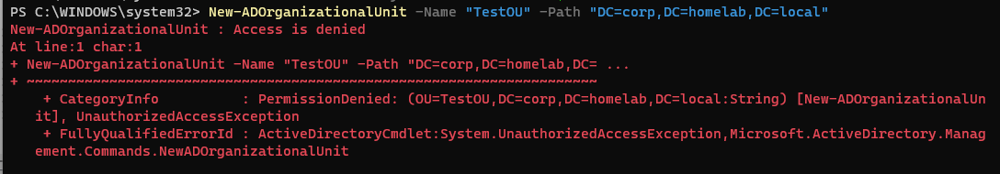
