# 07 - Helpdesk Scenario Walktroughs

## Overview
- This part documents common helpdesk tickets as mini case studies, each worked the way a real ticket would be handed: A symptom is reported, investigated, resolved, and verified.
- Password reset and account unlock tickets are resolved using the delegated `GG-IT-Users` instead of `CORP\Administrator`. Matching how an actual helpdesk technician operates with elevated access reserved only for tasks genuinely outside of that scope.

### Accounts used in these scenarios:

| Account    | Department | Role in these tickets                                           |
| ---------- | ---------- | --------------------------------------------------------------- |
| `rhidayat` | IT         | Helpdesk technician, member of `GG-IT-Users` - resolves tickets |
| `jroe`     | Sales      | End users - reports tickets                                     |
| `alee`     | HR         | End user - reports tickets                                      |
| `msutrisno`     | IT         | End user - reports tickets                                      |

***

## Ticket 1 : Password Reset

### Report

**Report** by `alee` from HR
```txt
I forgot my password and can't log into my computer
```

### Investigation
**Investigation** (as `rhidayat`): Confirmed the account exist and checked its current lockout status before acting

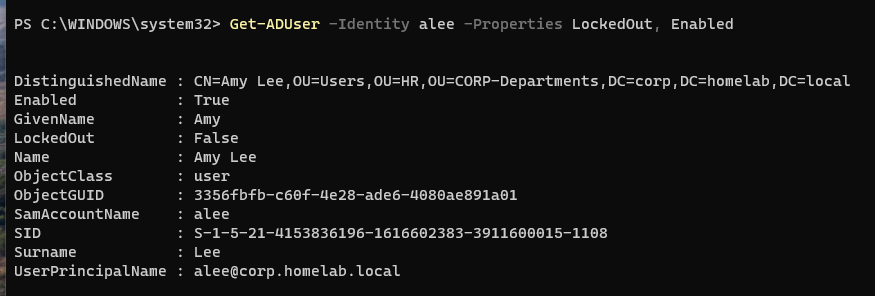

### Resolution 

**Resolution (GUI)**
1. Open **Active Directory Users and Computers**

2. Navigate to `CORP-Departments` **-> HR -> Users**

    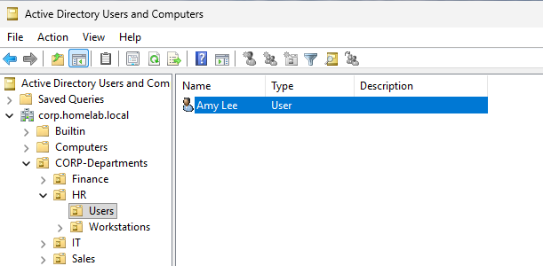

3. Right-click `Amy Lee` **-> Reset Password**

    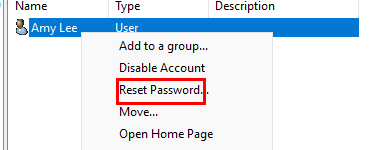

4. Set a temporary password, check **User must change password at next logon**

    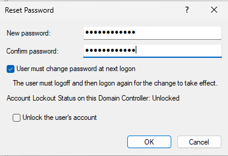

5. OK

**Resolution (PowerShell - Same result, faster for repeat tickets)**

```powershell
Set-ADAccountPassword -Identity jroe -Reset -NewPassword (ConvertTo-SecureString "TempPass123!" -AsPlainText -Force)
Set-ADUser -Identity jroe -ChangePasswordAtLogon $true
```

***

## Ticket 2 : Account Lockout

### Report

**Report** from Jane Roe `jroe` from sales"
```
"My account says it's locked out, I didn't even get my password wrong that many times
```

### Investigation

**Investigation** (as `rhidayat` from IT): Confirmed the lockout and checked how recently it happened:
```powershell
Get-ADUser -Identity alee -Properties LockedOut, BadPwdCount, LastBadPasswordAttempt
```

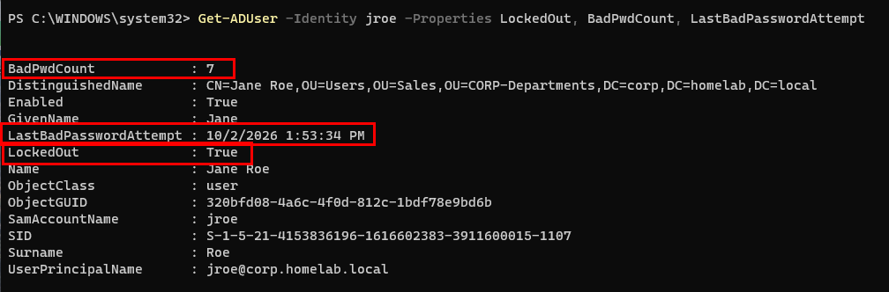
- `LockedOut: True`, with several bad attempts 

### Resolution

**Resolution via GUI**
1. Open ADUC

2. Right-click the user -> **Properties -> Account Tab ->** check **Unlock Account -> Apply -> OK** 

    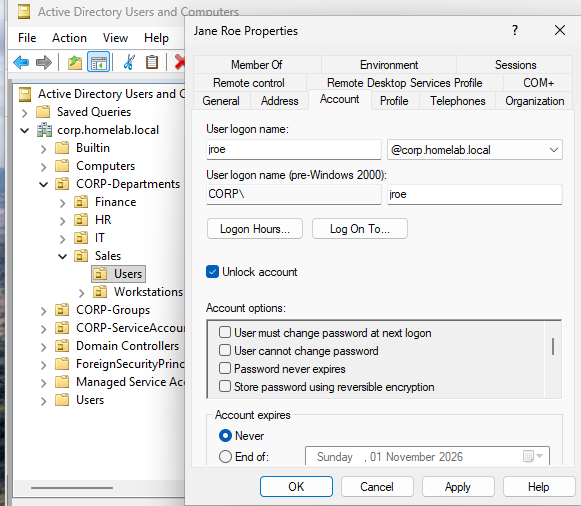

3. Reset password by redoing steps from ticket 1

**Resolution via PowerShell Command**
```powershell
Unlock-ADAccount -Identity alee
```

### Verify

1. Through Windows GUI

    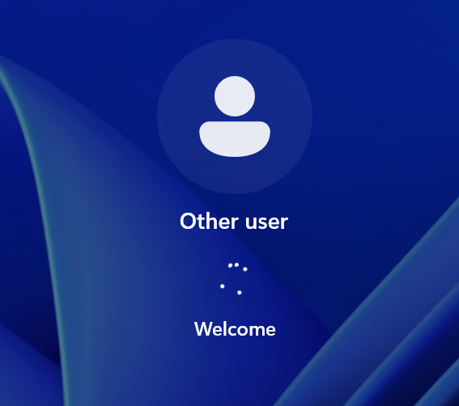

2. Verify via PowerShell command 
    ```powershell
    Get-ADUser -Identity alee -Properties LockedOut
    ```

    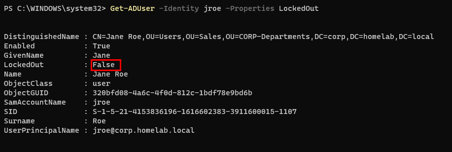

***

## Ticket 3 : New Hire Onboarding

### Report

**Request** : HR has a new a Finance department hire starting Monday, needs an account and shared drive access. 
- Full Name : Andre Taulany
- OU : Finance
- Group : `GG-User-Finance`

### Resolution

**Resolution via GUI**
1. Open **Active Directory Users and Computers**

2. Navigate to `corp.homelab.local → CORP-Departments → Finance → Users`

3. Right-click the **Users** OU → **New → User**

    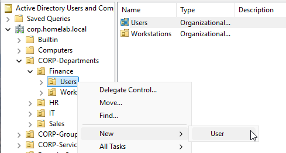

4. Fill in First name, Last name, User logon name (e.g. `ataulany`) -> Next

    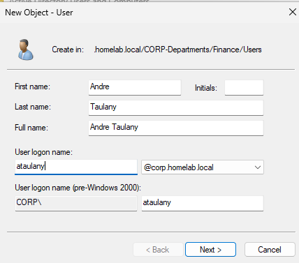

5. Next → set a temporary password → check **User must change password at next logon**

    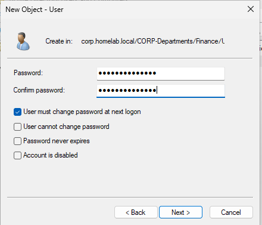

6. To add `ataulany` to a group, right-click -> **All Tasks -> Add to a group**

    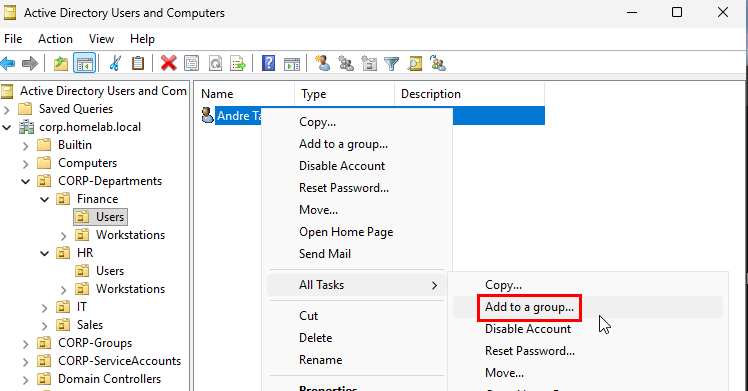

7. Enter `GG-Finance-Users` -> Ok

    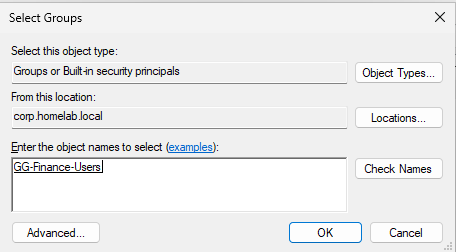

### Verify

1. Via GUI: Log in as `ataulany` and insert the password and it will be asks to enter new password if the user is successfully created

    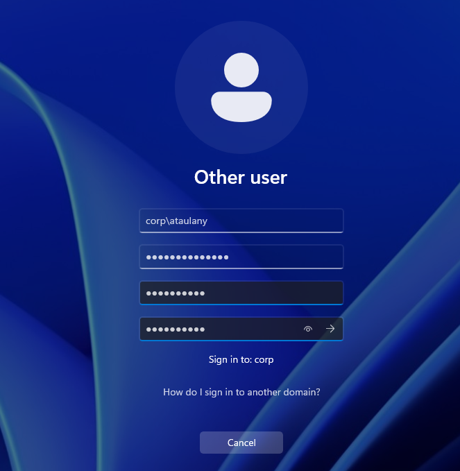

2. Via PowerShell :

    ```powershell
    Get-ADUser -Identity ataulany | Select DistinguishedName
    Get-ADPrincipalGroupMembership -Identity ataulany | Select-Object Name
    ```

    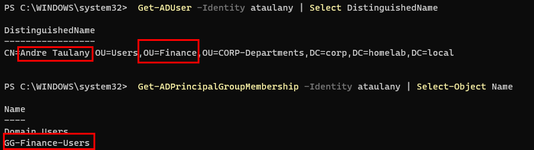

***

## Ticket 4 : Offboarding

### Report
**Request** 

```txt
an employee named Jane Roe has left the company, their access needs to be fully revoked, not just diabled loosely
```

### Resolution

 The goal is to immediately cut access while preserving the account for a retention period, rather than deleting it outright (deleting loses audit history and break any file ownership tied to the SID)

**Resolution GUI** 

1. Open **Active Directory Users and Computers**, locate the user (e.g., `jroe` or `Jane Roe` under sales or under `CORP-Department`) Right-click -> **Find** and type the name

    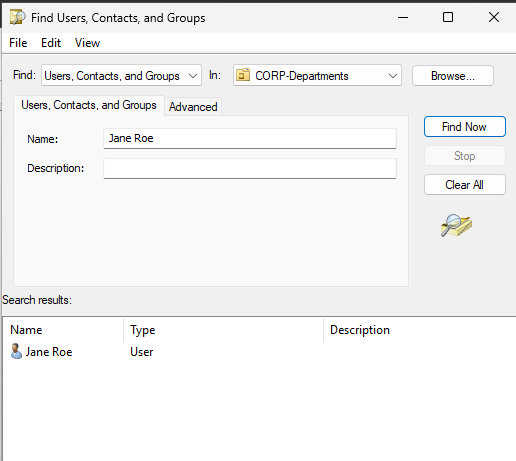

2. Right-click -> **Disable Account**, cuts off login access immediately 

    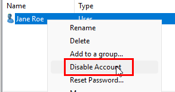

3. Double-click the user -> **Member of** tab -> select each group except **Domain Users** -> **Remove** -> Apply -> OK, one at a time if it's more than one, since ADUC doesn't offer a bulk remove-all here

    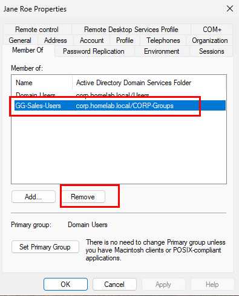

4. Right-click -> **Reset Password** -> Set a long random value, don't communicate it to anyone, and leave **User must change password at next logon** uncheck, the account shouldn't be usable going forward at all, not just inconvenient to use

    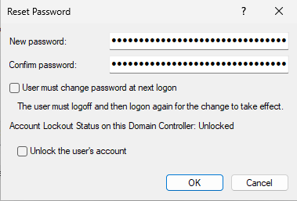

### Verification

```powershell
Get-ADUser -Identity jroe -Properties Enabled, MemberOf
```

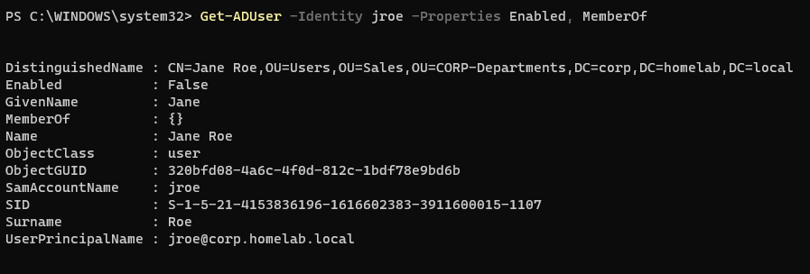

***

## Ticket 5 : Mapped Drive Missing After Login

### Report

**Reported by Muhammad Sutrisno `msutrisno`**, a new IT hire :
```txt
My I: drive isn't showing up after I log in, I need it for work. I was told that I supposed to have that drive once I log in
```

### Resolution

Log in as `rhidayat` from IT

1. Confirm the share itself isn't the problem 
	- Before touching Group Policy at all, it's worth ruling out the simpler explanation, because maybe the share is just down.
	- Try connecting to the share directly, which is reachable as per the result below

    ```powershell
	net use Z: \\DC01\IT-Department
	```

    

    - That rules out the share/NTFS permissions.

2. Check the user's properties
	- In ADUC, Right-click `msutrisno` -> **Properties** -> open **Member of** tab -> look for `GG-IT-Users`, we found the root cause since the user isn't a member of that `GG-IT-Users` group

        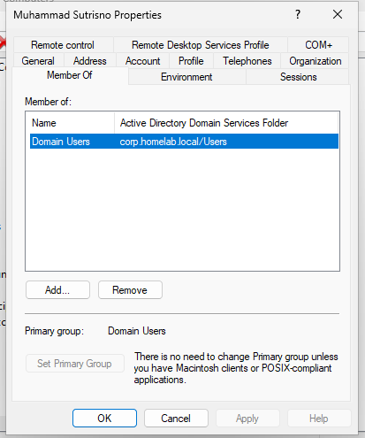

    - To add him, click **Add...** -> find `GG-IT-Users` -> OK

        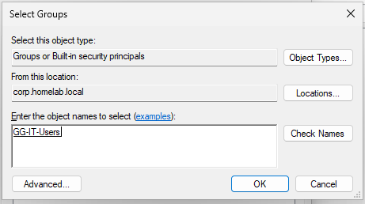

    - force the update
		```powershell
		gpupdate /force
		```

### Verify

- Log in as `msutrisno` and the `I` drive is available to access

    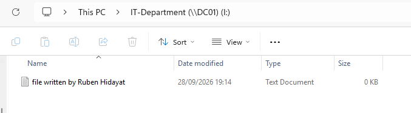